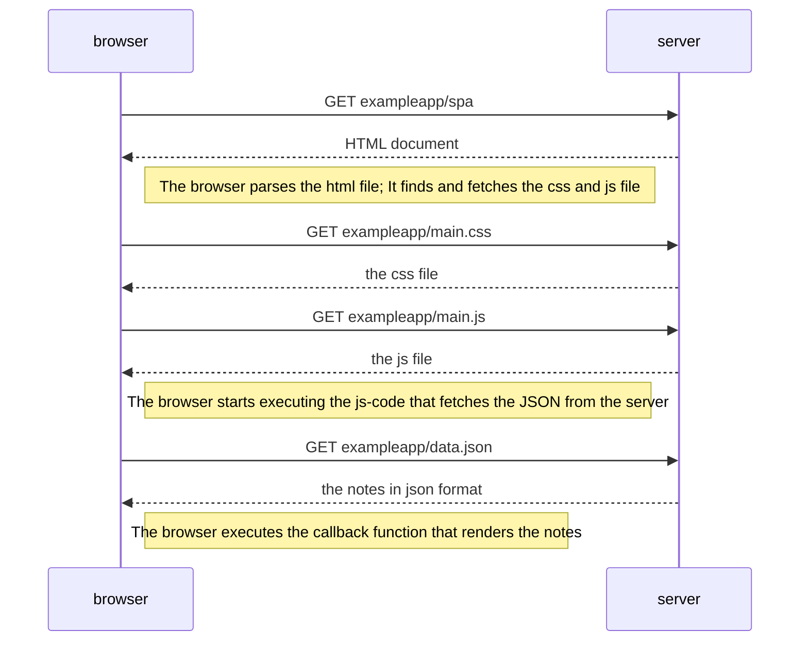

# opening /exampleapp/spa

```mermaid
sequenceDiagram
    participant browser
    participant server

    browser->>server: GET exampleapp/spa
    server-->>browser: HTML document

    Note right of browser: The browser parses the html file#semi; It finds and fetches the css and js file

    browser->>server: GET exampleapp/main.css
    server-->>browser: the css file

    browser->>server: GET exampleapp/main.js
    server-->>browser: the js file

    Note right of browser: The browser starts executing the js-code that fetches the JSON from the server

    browser->>server: GET exampleapp/data.json
    server-->>browser: the notes in json format

    Note right of browser: The browser executes the callback function that renders the notes
```
